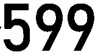

# 基于yolov5 商品价格标签识别（yolov5 for price tag recognition）

## 依赖
- pip install -r requirements.txt 安装环境依赖
- 若没有GPU加速更改utils/parameters.py self.device='cpu'即可

## 运行
- python main.py

## 输出
- runs/detect/exp/images 截取的价格位置图片
- runs/detect/exp/labels 读取到的数字标签
- runs/detect/exp/price 原图文件名与价格以.分割命名的txt文件，文件里为价格
# 更新
## 1.1读取本地图片并识别价格

- 101165352.599.txt :599
## 1.2更新可读取url图片并返回价格
- 更改utils/parameters.py url=Ture
